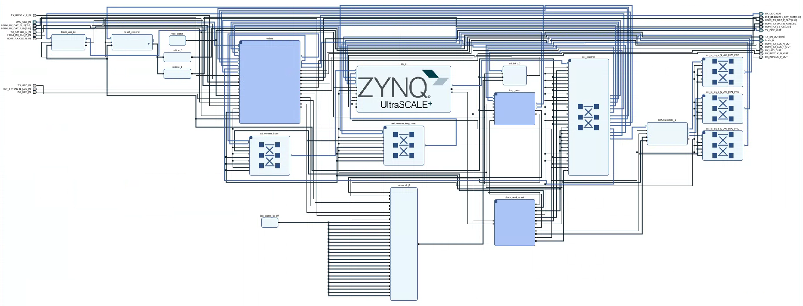
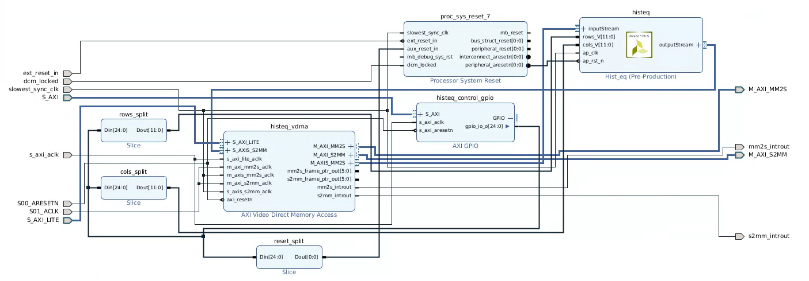
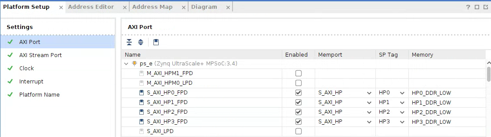

# LEAP Hardware Design




------

## Overview
The hardware design uses three main IP groups: HDMI, Video Enhancement Pipeline (VEP), and Deep Processing Unit (DPU). The HDMI design comes from the [PYNQ](https://github.com/Xilinx/PYNQ) example HW design. The DPU is added in using Vitis by following the [DPU-PYNQ](https://github.com/Xilinx/DPU-PYNQ). The HDMI, VEP, and DPU each have a seperate Axi bus to the PS.

## Getting Started

1. Make sure Vitis and Vitis HLS (version 2022.1 or 2022.2) is installed and sourced. Then cd into the same directory as this README.

2. Clone the PYNQ repository
```bash
git clone https://github.com/Xilinx/PYNQ
```

3. Navigate to `PYNQ/boards/ZCU104/base` and run the makefile to compile the HLS IPs
```bash
make hls_ip
```
This can take a while to finish so be patient.

4. Once finished navigate back to `workdir` and clone the PYNQ-DPU repository
```bash
git clone https://github.com/Xilinx/DPU-PYNQ
```

5. Copy the `platform_project` folder to `DPU-PYNQ/boards/zcu104`.

6. Open the Vivado project in `DPU-PYNQ/boards/zcu104/platform_project/platform_project.xpr`.
```bash
vivado platform_project.xpr
```

7. Add the IPs generated in step 3 to the Vivado project. These are needed for the HDMI design. To do this click the gear icon -> IP -> Repository -> Add. Then navigate to `PYNQ/boards/ZCU104/base/hls_ip` and click OK.

8. Run the synthesis step.

9. Export the hardware design to Vitis. Under **IP Integrator** click **Export Platform**. Click Next -> Select **Hardware** option -> Next -> **Pre-synthesis** -> Next -> Set the XSA File name to **platform** and make sure to export it to `DPU-PYNQ/boards/zcu104/platform_project` -> Next -> Finish. There should now be a new file in `DPU-PYNQ/boards/zcu104` called `platform.xsa`. If there is not the do not proceed to the next step as your `platform_project`` will be overwritten.

10. Copy the `prj_config` file from this repository to `DPU-PYNQ/boards/zcu104` overwriting the existing file.

11. Navigate to `DPU-PYNQ/boards` and run the makefile to compile the DPU IPs
```bash
make BOARD=zcu104
```
> Note: This step adds the DPU to the Vivado design. If you wish to see the complete design open the Vivado project in DPU-PYNQ/boards/zcu104/binary_container_1/link/vivado/vpl/prj/prj.xpr.


12. Once finished you can find the output files in `DPU-PYNQ/boards/zcu104/`. There should be:
- `dpu.bit`
- `dpu.hwh`
- `dpu.xclbin`

If you wish to renaim these make sure to rename them all to the same names (not including the file extension).

## Modifying the design

### VEP
The video enhancement pipeline is designed to be easily configurable. Image enhancement IPs can be daisy-chained together via Axi-Stream connections to and from the `histeq_vdma` IP. The resolution can be controlled using the Axi-GPIO IP.



> Note: For this research we created a Histogram Equalization (HE) IP as a proof-of-concept. This IP is not included as it is proprietary and closed sourced. But there IPs can be found from Xilinx that process video over Axi-Stream.

### Platform Setup
When modifying the design, close attention must be paid to the platform setup in vivado and the `prj_config`. The platform setup is how vivado comunicates to vitis what buses to add IPs to.

