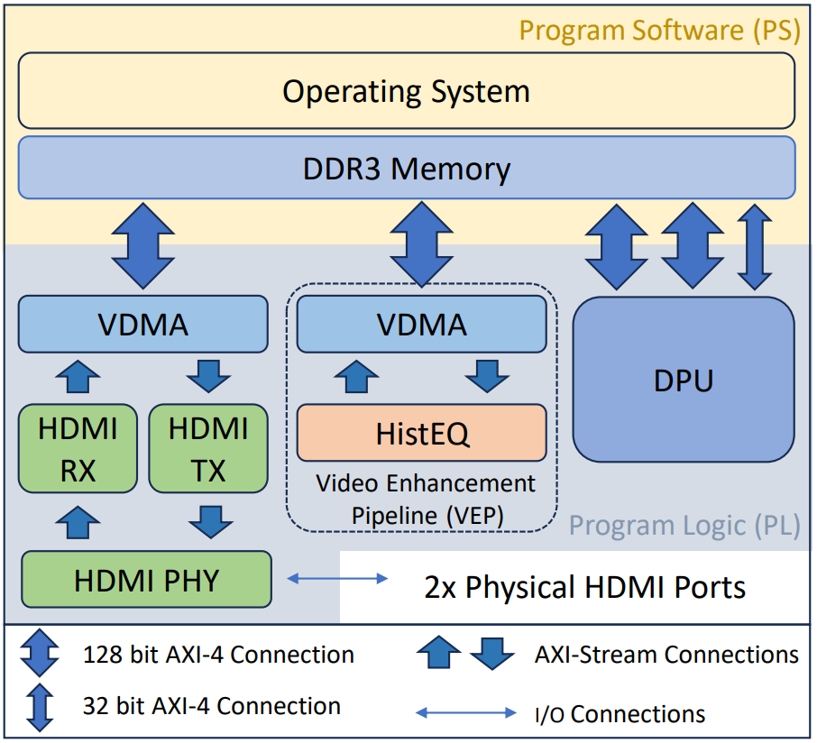
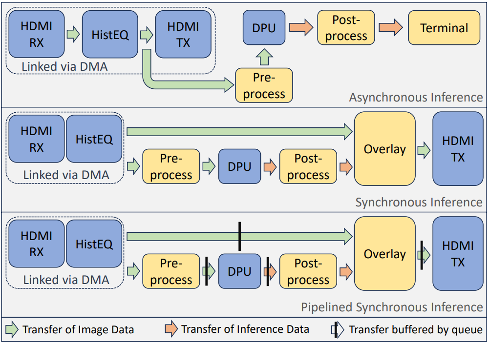
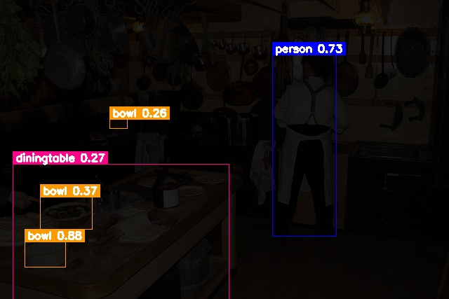
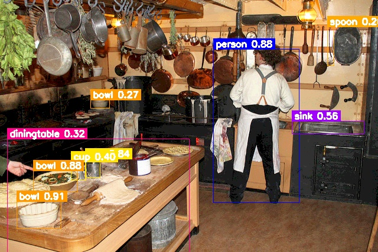

# LEAP

Integration of rea**L**-time image **E**nhancement and **A**I inferencing engine in the **P**YNQ environment

-----

## Overview
LEAP provides a platform for integrating real-time image enhancement and AI inferencing engine in the PYNQ environment for Xilinx's MPSoC [ZCU104](https://www.xilinx.com/products/boards-and-kits/zcu104.html) FPGA development board. The computation of image enhancement and AI inference in processed in the Program Logic (PL) why being controlled via Python scripts running in Linux. The platform is designed to allow for straight forward integration of new image enhancement IPs and AI models. As a proof-of-concept we use an image enhancement IP to enhance dark images before being inferenced on by CNN models in real-time.

#### LEAP System Overview

## Infererencing
We provided multiple implementations of inferencing that can favor either throughput or latency

#### Inferencing Methods

--------

## Example

#### YOLOv3 on Dark COCO Image

#### YOLOv3 on Dark + Histogram Equalization on Dark COCO Image

-----

## Getting Started

This repository is composed of 3 main components:
1. [Hardware Design](HW_Design/README.md) - Details and implementation of the FPGA design
2. [Custom Pynq Image](pynq_img_gen/README.md) - Details of modifying the PYNQ SD card image to increase the size of the Contiguous Memory Allocator (CMA).
3. [Runtime Code](runtime/README.md) - Details and implementation of the code that controls real-time HDMI in/out, AI inferencing, and image enhancement.